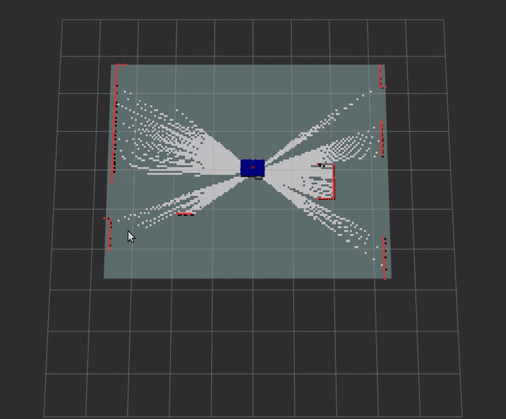

# ros2-slam-navigation-robot

Автономный мобильный робот на ROS 2. Дифференциальный привод, две depth-камеры (Orbbec Astra), 
ультразвуковые датчики, GPS, IMU, лидар 360°.
SLAM, навигация, симуляция в Gazebo Classic. Целевое железо — Raspberry Pi 5.



## Стек

- **ROS 2 Humble** (Ubuntu 22.04)
- **Gazebo Classic** + `gazebo_ros_pkgs`
- **slam_toolbox** — SLAM в режиме mapping
- **Cartographer** — альтернативный SLAM (2D/3D, экспериментально)
- **Nav2** — планирование пути и управление
- **AMCL** — локализация по готовой карте
- **robot_localization** — слияние одометрии и GPS (план)
- **Docker** — воспроизводимая сборка для Raspberry Pi 5

## Железо

| Компонент | Модель |
|---|---|
| Вычислитель | Raspberry Pi 5 |
| Лидар | 360°, 15 Гц (`/scan_lidar`) |
| Камеры | Orbbec Astra × 2 (передняя + задняя, depth) |
| IMU | 100 Гц (`/imu/data`) |
| Дальномеры | HC-SR04 × 3 (front, left, right) |
| GPS | NMEA-модуль (UART) |
| Привод | Дифференциальный, 2 ведущих колеса + кастер |

## Структура репозитория

```
├── my_robot_bringup  
│   ├── CMakeLists.txt  
│   ├── config  
│   │   ├── slam_params.yaml  
│   │   └── nav2_params.yaml  
│   ├── launch  
│   │   └── my_robot_gazebo.launch.xml  
│   ├── package.xml  
│   ├── rviz  
│   │   └── urdf_config.rviz  
│   ├── scripts  
│   │   ├── merge_scans.py  
│   │   └── cloud_to_scan.py  
│   └── worlds  
│       └── test_world.world  
├── my_robot_description  
│   ├── CMakeLists.txt  
│   ├── config  
│   │   └── config.rviz  
│   ├── launch  
│   │   ├── display.launch.py  
│   │   └── display.launch.xml  
│   ├── package.xml  
│   └── urdf  
│       ├── my_robot.urdf.xacro 
│       ├── imu.xacro  
│       ├── lidar.xacro  
│       ├── camera.xacro  
│       ├── common_properties.xacro  
│       ├── gps_module.xacro  
│       ├── mobile_base_gazebo.xacro  
│       ├── mobile_base.xacro  
│       └── sonic_radar.xacro  
├── Dockerfile  
├── requirements.txt  
├── docker-compose.yaml  
└── README.md  
```

## Быстрый старт (симуляция)

```bash
# 1. Сборка
cd ~/ros2-slam-navigation-robot
colcon build --symlink-install
source install/setup.bash

# 2. Запуск Gazebo + SLAM + RViz (лидарный путь, по умолчанию)
ros2 launch my_robot_bringup my_robot_gazebo.launch.xml
```

### Лидарный путь (по умолчанию, самый надёжный)

Скан: `/scan_lidar` (360°, 15 Гц). SLAM: slam_toolbox. Карта: `/map`.

```bash
ros2 launch my_robot_bringup my_robot_gazebo.launch.xml
```

### Камерный путь

Скан из облака точек полосой по высоте:

```bash
ros2 launch my_robot_bringup my_robot_gazebo.launch.xml \
  start_slam:=false urdf_args:="with_depth_cameras:=true with_rear_camera:=true"

# в другом терминале — скан из облака
ros2 run my_robot_bringup cloud_to_scan.py --ros-args \
  -p inputs:="['/depth_camera/points', '/depth_camera_rear/points']" \
  -p output:=/scan_band

# SLAM на этом скане
ros2 run slam_toolbox async_slam_toolbox_node \
  --params-file install/my_robot_bringup/share/my_robot_bringup/config/slam_params.yaml \
  -p scan_topic:=/scan_band -p use_sim_time:=true
```

## Launch-аргументы

| Аргумент | По умолчанию | Зачем |
|---|---|---|
| `gui` | `true` | окно Gazebo |
| `rviz` | `true` | окно RViz |
| `start_slam` | `true` | поднимать ли slam_toolbox |
| `scan_topic` | `/scan_lidar` | топик скана для SLAM |
| `urdf_args` | `with_depth_cameras:=false` | аргументы xacro |
| `spawn` | `true` | спавнить ли робота из launch |
| `spawn_delay` | `8.0` | задержка спавна, с |
| `spawn_x/y/yaw` | `0 0 0` | поза спавна |

## Управление

```bash
# Движение вперёд
ros2 topic pub /cmd_vel geometry_msgs/msg/Twist \
  "{linear: {x: 0.15}, angular: {z: 0.0}}"

# Поворот на месте
ros2 topic pub /cmd_vel geometry_msgs/msg/Twist \
  "{linear: {x: 0.0}, angular: {z: 0.3}}"
```

## Топики

| Топик | Тип | Источник |
|---|---|---|
| `/scan_lidar` | `sensor_msgs/LaserScan` | лидар 360° |
| `/scan_band` | `sensor_msgs/LaserScan` | `cloud_to_scan.py` (полоса по высоте) |
| `/scan` | `sensor_msgs/LaserScan` | `merge_scans.py` (слияние камер) |
| `/map` | `nav_msgs/OccupancyGrid` | slam_toolbox |
| `/odom` | `nav_msgs/Odometry` | diff_drive_controller |
| `/cmd_vel` | `geometry_msgs/Twist` | внешний |
| `/depth_camera/depth/image_raw` | `sensor_msgs/Image` | передняя depth-камера |
| `/depth_camera/points` | `sensor_msgs/PointCloud2` | передняя depth-камера |
| `/depth_camera_rear/points` | `sensor_msgs/PointCloud2` | задняя depth-камера |
| `/imu/data` | `sensor_msgs/Imu` | IMU |
| `/front_ultrasonic/range` | `sensor_msgs/Range` | HC-SR04 (front) |
| `/left_ultrasonic/range` | `sensor_msgs/Range` | HC-SR04 (left) |
| `/right_ultrasonic/range` | `sensor_msgs/Range` | HC-SR04 (right) |
| `/gps/fix` | `sensor_msgs/NavSatFix` | GPS-модуль |

## TF-дерево

```
map  
└── odom  
    └── footprint_link  
        └── base_link  
            ├── camera_link  
            │   └── camera_link_optical  
            ├── camera_rear_link  
            │   └── camera_rear_link_optical  
            ├── lidar_link  
            ├── imu_link  
            ├── front_ultrasonic_link  
            ├── left_ultrasonic_link  
            ├── right_ultrasonic_link  
            ├── gps_link  
            ├── left_wheel_link  
            ├── right_wheel_link  
            └── caster_wheel_link  
```

## Что было изменено

- **Убран `depthimage_to_laserscan`** - он брал одну строку кадра, и скан смотрел в пол
  («кольцо по полу»). Заменён на `cloud_to_scan.py` (полоса по высоте) и
  `merge_scans.py` (слияние сканов с нескольких камер).
- **Добавлена вторая depth-камера** (задняя). Один скан 85.9° слишком узок.
- **Добавлен лидар 360°** (`lidar.xacro`) - эталонный источник для SLAM.
- **Добавлен IMU** (`imu.xacro`) - для 3D-пути Cartographer (экспериментально).
- **Launch стал универсальным** — аргументы вместо жёстко зашитых значений.
- **`nav2_params.yaml`** - конфиг Nav2 + AMCL для камерного варианта. На данном этапе не используется.
- **RViz** - добавлены дисплеи Map, LaserScan, граф slam_toolbox.

## Известные ограничения

- **GPS в симуляции** публикует `NavSatFix` без слияния с одометрией. `robot_localization` пока не подключён.  
## TODO

### Сделано ✅

- [x] URDF/Xacro с модульной структурой (base, camera, lidar, IMU, ultrasonic, GPS)  
- [x] Дифференциальный привод в Gazebo (`libgazebo_ros_diff_drive.so`)  
- [x] Depth-камеры × 2 (`libgazebo_ros_camera.so`) с optical frame  
- [x] Лидар 360° (`libgazebo_ros_ray_sensor.so`)  
- [x] IMU (`libgazebo_ros_imu_sensor.so`)  
- [x] Ультразвуковые датчики (3 шт.) через `libgazebo_ros_ray_sensor.so`  
- [x] GPS через `libgazebo_ros_gps_sensor.so`  
- [x] Скан из облака точек полосой по высоте (`cloud_to_scan.py`)  
- [x] Слияние сканов с нескольких камер (`merge_scans.py`)  
- [x] Launch с аргументами (gui, rviz, start_slam, scan_topic, urdf_args, spawn_*)  
- [x] Запуск `slam_toolbox` в режиме mapping, карта строится  
- [x] Топики датчиков публикуются, TF-цепочка корректна  
- [x] Loop closure работает (`restamp_tf: true`, `loop_search_*` настроены)  
- [x] `nav2_params.yaml` для камерного варианта  

### В работе 🚧

- [ ] **Nav2-патруль** — отладка маршрутов и ошибки локализации
- [ ] **Cartographer 2D/3D** — довести прогон до конца

### Не начато ❌

- [ ] **Costmap-слои.** Подключить ультразвук и GPS в costmap'ы Nav2.  
- [ ] **robot_localization.** Слияние одометрии колёс и GPS в единый `/odom` (EKF).  
- [ ] **Docker.** Dockerfile с ROS 2 Humble и всеми зависимостями для Raspberry Pi 5.  
- [ ] **Реальное железо.** Сборка, отладка электроники, полевые испытания.  
- [ ] **Orbbec Astra на реальном железе.** Запуск `orbbec_camera` через OrbbecSDK_ROS2.  
- [ ] **NMEA-драйвер GPS.** Парсинг NMEA-сообщений через `nmea_navsat_driver`.  
- [ ] **Twist mux.** Приоритизация команд от Nav2, телеопа и аварийной остановки.  
- [ ] **Тесты.** Юнит-тесты для узлов, integration-тесты в Gazebo.  
- [ ] **Документация.** Описание API, схемы подключения, калибровки.  

## Лицензия

MIT
